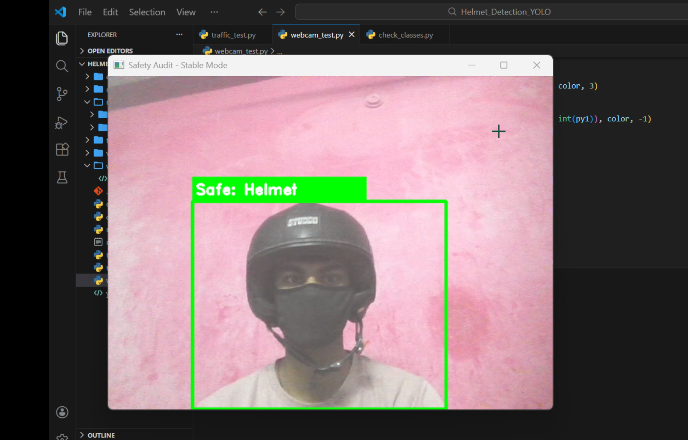
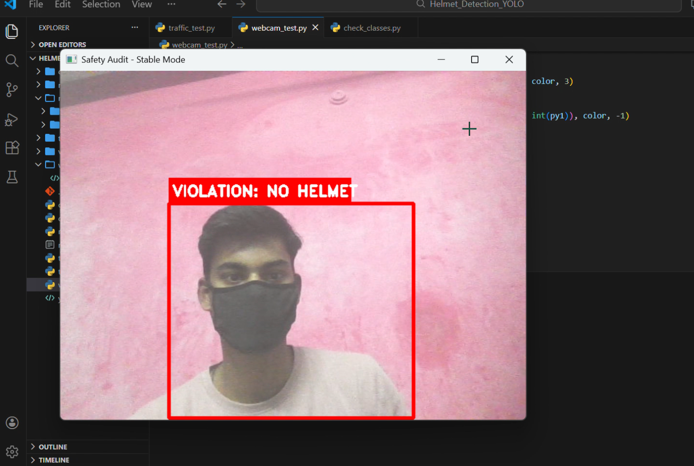

# 🛡️ Smart Helmet Safety Audit System
A real-time computer vision system built with **YOLOv8** to monitor safety compliance and detect helmet violations.

---

## 🌟 Project Overview
This project addresses road and industrial safety by automating the detection of helmet usage. Using a custom-trained AI model, the system identifies individuals and determines if they are wearing protective headgear. 

### Key Features:
* **Custom YOLOv8 Training:** Trained on high-resolution safety datasets for high accuracy.
* **Dual-Model Logic:** Utilizes a base model for person detection and a custom model for helmet verification.
* **Temporal Smoothing:** Implemented a 10-frame buffer to prevent flickering and false violation alerts.
* **Real-Time Audit:** Optimized for live webcam streams with professional HUD overlays.

---

## 🚀 How It Works
Since the custom model was specialized in "Helmet" detection, I implemented **Exclusion Logic** to identify violations:
1. **Person Detection:** A standard YOLOv8 model identifies humans in the frame.
2. **Helmet Verification:** The custom model checks for a helmet box overlapping with the person.
3. **Safety Status:** If a person is found without a corresponding helmet detection, the system triggers a **RED "VIOLATION"** alert.

---

## 🛠️ Tech Stack
* **Language:** Python 3.x
* **AI Engine:** Ultralytics YOLOv8
* **Library:** OpenCV (Real-time image processing)
* **Dataset Hosting:** Roboflow

📊 Results
The system maintains high stability even in varied lighting conditions due to the implemented Frame Memory logic.

**Status            Visual Indicator                   Condition**
SAFE              Blue Bounding Box           Helmet detected on person
VIOLATION         Red Bounding Box            No Helmet detected on person


## 📸OUTPUTS:
### Project Results


-----------------------------------------------------------

## 📥 Installation & Setup

1. **Clone the project:**
   ```bash
   git clone <your-repository-link>
   cd Helmet_Detection_YOLO

## 2. Set up Virtual Environment:
 python -m venv venv
# Windows:
venv\Scripts\activate
# Mac/Linux:
source venv/bin/activate

## 3. Install Dependencies:
pip install -r requirements.txt


## How to Use
Run the main control center to access the system: python main.py
**Option 1:** Launches the Live Webcam Audit.

**Option 2:** Runs the system on pre-recorded traffic footage.